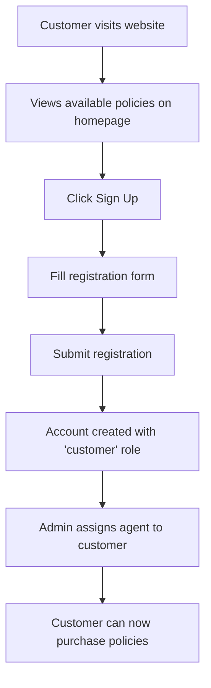
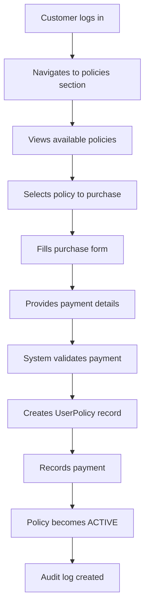
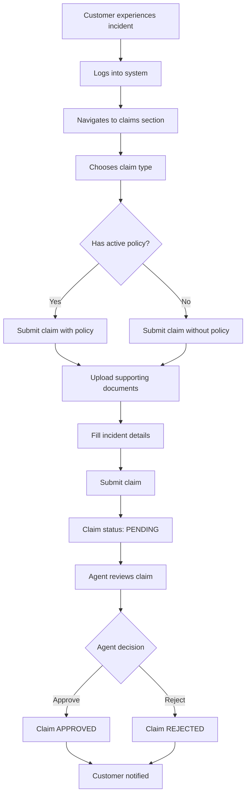
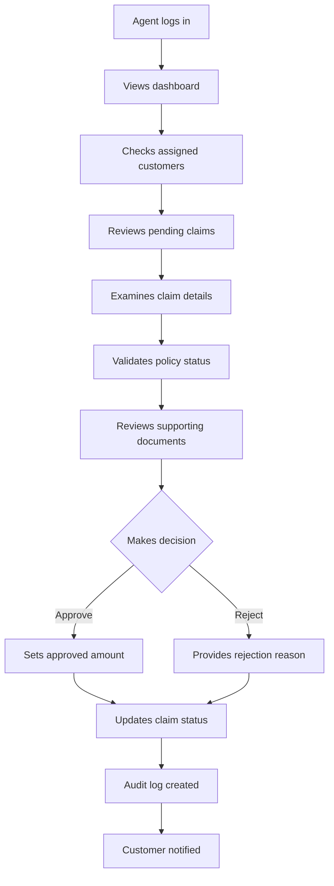
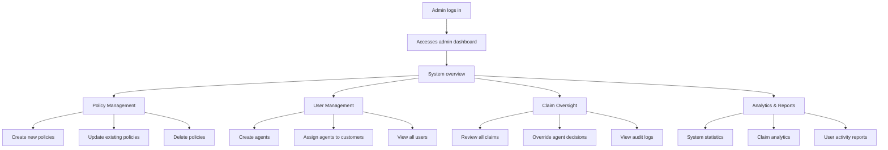

# LifeShield Insurance System - Complete Workflow Documentation

## Table of Contents
1. [System Overview](#system-overview)
2. [Architecture](#architecture)
3. [User Roles & Permissions](#user-roles--permissions)
4. [Database Schema](#database-schema)
5. [Authentication & Authorization](#authentication--authorization)
6. [Complete User Workflows](#complete-user-workflows)
7. [API Endpoints](#api-endpoints)
8. [Frontend Components](#frontend-components)
9. [Security Features](#security-features)
10. [Deployment & Configuration](#deployment--configuration)

## System Overview

**LifeShield** is a comprehensive insurance management system built with modern web technologies. It provides a complete solution for insurance policy management, claims processing, and customer-agent relationships.

### Technology Stack
- **Frontend**: Angular 20+ with TypeScript, Tailwind CSS, NgRx for state management
- **Backend**: Node.js with Express.js, MongoDB with Mongoose
- **Authentication**: JWT tokens with GraphQL and REST API
- **File Storage**: Cloudinary for image uploads
- **Database**: MongoDB with comprehensive audit logging

## Architecture

```
┌─────────────────┐    ┌─────────────────┐    ┌─────────────────┐
│   Frontend      │    │   Backend       │    │   Database      │
│   (Angular)     │◄──►│   (Node.js)     │◄──►│   (MongoDB)     │
│                 │    │                 │    │                 │
│ • Components    │    │ • REST APIs     │    │ • User          │
│ • Services      │    │ • GraphQL       │    │ • PolicyProduct │
│ • Guards        │    │ • Controllers   │    │ • UserPolicy    │
│ • State Mgmt    │    │ • Middleware    │    │ • Claim         │
│                 │    │ • Models        │    │ • Payment       │
│                 │    │                 │    │ • AuditLog      │
└─────────────────┘    └─────────────────┘    └─────────────────┘
```

## User Roles & Permissions

### 1. Admin
- **Permissions**: Full system access
- **Capabilities**:
  - Create, update, delete insurance policies
  - Manage agents and customers
  - Assign agents to customers
  - Review and approve/reject claims
  - View system analytics and audit logs
  - Access summary dashboard

### 2. Agent
- **Permissions**: Limited to assigned customers
- **Capabilities**:
  - View assigned customers and their policies
  - Review and approve/reject claims for assigned customers
  - View claim statistics and analytics
  - Update personal profile
  - Access customer policy and claim history

### 3. Customer
- **Permissions**: Personal data and policies only
- **Capabilities**:
  - Browse and purchase insurance policies
  - View personal policies and payment history
  - Submit claims with supporting documentation
  - Submit claims without active policies (special feature)
  - View claim status and history
  - Update personal profile

## Database Schema

### Core Models

#### User Model
```javascript
{
  _id: ObjectId,
  name: String (required),
  email: String (required, unique),
  passwordHash: String (required),
  role: String (enum: ["admin", "customer", "agent"]),
  photo: String (default: ""),
  address: String (default: ""),
  assignedAgentId: ObjectId (ref: "User"),
  createdAt: Date,
  updatedAt: Date
}
```

#### PolicyProduct Model
```javascript
{
  _id: ObjectId,
  code: String (required, unique),
  title: String (required),
  description: String (required),
  premium: Number (required),
  termMonths: Number (required),
  minSumInsured: Number (required),
  imageUrl: String (required),
  createdAt: Date,
  updatedAt: Date
}
```

#### UserPolicy Model
```javascript
{
  _id: ObjectId,
  userId: ObjectId (ref: "User"),
  policyProductId: ObjectId (ref: "PolicyProduct"),
  startDate: Date (required),
  endDate: Date (required),
  premiumPaid: Number (required),
  status: String (enum: ["ACTIVE", "PENDING", "EXPIRED", "CANCELLED"]),
  nominee: String (required),
  createdAt: Date,
  updatedAt: Date
}
```

#### Claim Model
```javascript
{
  _id: ObjectId,
  userId: ObjectId (ref: "User"),
  userPolicyId: ObjectId (ref: "UserPolicy", optional),
  incidentDate: Date (required),
  incidentLocation: String (required),
  description: String (required),
  amountClaimed: Number (required),
  approvedAmount: Number (default: null),
  proofImage: [String],
  status: String (enum: ["PENDING", "APPROVED", "REJECTED"]),
  decisionNotes: String,
  decidedByAgentId: ObjectId (ref: "User"),
  decidedAt: Date,
  priority: String (enum: ["LOW", "MEDIUM", "HIGH"]),
  category: String (enum: ["ACCIDENT", "THEFT", "DAMAGE", "MEDICAL", "OTHER"]),
  policyType: String (default: "GENERAL"),
  isWithoutPolicy: Boolean (default: false),
  createdAt: Date,
  updatedAt: Date
}
```

#### Payment Model
```javascript
{
  _id: ObjectId,
  userId: ObjectId (ref: "User"),
  policyId: ObjectId (ref: "PolicyProduct"),
  userPolicyId: ObjectId (ref: "UserPolicy"),
  amount: Number (required, min: 0),
  method: String (enum: ["CREDIT_CARD", "DEBIT_CARD", "BANK_TRANSFER", "PAYPAL", "CASH"]),
  reference: String (required, unique),
  cardNumber: String (optional),
  upiId: String (optional),
  status: String (enum: ["PENDING", "COMPLETED", "FAILED", "REFUNDED"]),
  paymentDate: Date,
  createdAt: Date,
  updatedAt: Date
}
```

#### AuditLog Model
```javascript
{
  _id: ObjectId,
  action: String (required),
  actorId: ObjectId (ref: "User"),
  details: Object,
  ip: String,
  timestamp: Date (default: Date.now)
}
```

## Authentication & Authorization

### Authentication Flow
1. **Registration/Login**: Users authenticate via GraphQL mutations
2. **JWT Token**: Server issues JWT token upon successful authentication
3. **Token Storage**: Frontend stores token in localStorage
4. **Request Headers**: All authenticated requests include `Authorization: Bearer <token>`
5. **Token Validation**: Backend validates token on each request

### Authorization Guards
- **AuthGuard**: Ensures user is authenticated
- **RoleGuard**: Ensures user has appropriate role for route access
- **Route Protection**: All dashboard routes protected by both guards

## Complete User Workflows

### 1. Customer Registration & Onboarding



**Steps:**
1. Customer visits homepage and browses available policies
2. Clicks "Sign Up" button
3. Fills registration form (name, email, password, address, photo)
4. System creates account with role "customer"
5. Admin assigns an agent to the customer
6. Customer receives notification and can start purchasing policies

### 2. Policy Purchase Workflow



**Detailed Steps:**
1. **Login**: Customer authenticates via login form
2. **Browse Policies**: Views available policies with details (premium, term, coverage)
3. **Select Policy**: Chooses desired policy
4. **Purchase Form**: Fills in:
   - Start date
   - Term duration
   - Nominee information
   - Payment method (Credit Card, Debit Card, Bank Transfer, PayPal, Cash)
   - Payment reference
   - Card number or UPI ID (if applicable)
5. **Validation**: System validates:
   - Required fields
   - Payment method
   - No duplicate active policy of same type
   - Unique payment reference
6. **Policy Creation**: Creates UserPolicy with status "ACTIVE"
7. **Payment Recording**: Records payment with status "COMPLETED"
8. **Audit Logging**: Logs the purchase action

### 3. Claim Submission Workflow



**Detailed Steps:**

#### With Active Policy:
1. **Incident Occurs**: Customer experiences covered incident
2. **Login**: Customer accesses their dashboard
3. **Claim Form**: Fills out:
   - Associated policy selection
   - Incident date (must be within policy period)
   - Incident location
   - Detailed description
   - Claimed amount
   - Supporting documents (minimum 2 images)
4. **Validation**: System checks:
   - Policy is active
   - Incident date within policy period
   - Required documentation provided
   - Customer has assigned agent
5. **Submission**: Claim created with status "PENDING"
6. **Agent Review**: Assigned agent reviews claim
7. **Decision**: Agent approves/rejects with notes and approved amount

#### Without Active Policy:
1. **Special Feature**: System allows claims without active policies
2. **Claim Form**: Similar to above but without policy selection
3. **Policy Type**: Customer specifies what type of policy the claim relates to
4. **Review Process**: Same agent review process
5. **Flagged**: Claim marked as `isWithoutPolicy: true`

### 4. Agent Workflow



**Agent Capabilities:**
1. **Customer Management**: View all assigned customers
2. **Policy Overview**: See customer policy details and history
3. **Claim Review**: Review pending claims with full details
4. **Decision Making**: Approve/reject with notes and amounts
5. **Analytics**: View claim statistics and trends
6. **Profile Management**: Update personal information

### 5. Admin Workflow



**Admin Capabilities:**
1. **Policy Management**: Full CRUD operations on insurance policies
2. **User Management**: Create agents, assign customers to agents
3. **System Oversight**: Monitor all activities via audit logs
4. **Analytics**: Comprehensive system statistics and reports
5. **Claim Management**: Review and override claim decisions

## API Endpoints

### Authentication (GraphQL)
- `POST /graphql` - GraphQL endpoint for authentication
  - `signup(input: SignupInput!)` - User registration
  - `login(input: LoginInput!)` - User login
  - `me` - Get current user details

### Admin Endpoints (`/api/v1/admin`)
- `POST /policies` - Create new policy
- `GET /policies` - List all policies
- `PUT /policies/:policyId` - Update policy
- `DELETE /policies/:policyId` - Delete policy
- `GET /users` - List all users
- `POST /agents` - Create new agent
- `GET /claims` - List all claims
- `PUT /claims/:id` - Update claim status
- `GET /audit-logs` - View audit logs
- `POST /assign-agent` - Assign agent to customer
- `GET /summary` - System summary statistics

### Customer Endpoints (`/api/v1/customer`)
- `GET /policies` - Get available policies
- `GET /my-policies` - Get customer's policies
- `POST /policies/:policyId/purchase` - Purchase policy
- `PUT /my-policies/:id/cancel` - Cancel policy
- `POST /claims` - Submit claim
- `POST /claims/without-policy` - Submit claim without policy
- `GET /claims` - Get customer's claims
- `GET /claims/:claimId` - Get claim details
- `GET /claims-stats` - Get claim statistics
- `GET /agent-assignment` - Check agent assignment

### Agent Endpoints (`/api/v1/agent`)
- `GET /profile` - Get agent profile
- `PUT /profile` - Update agent profile
- `GET /customers` - Get assigned customers
- `GET /customers/:customerId/policies` - Get customer policies
- `GET /customers/:customerId/claims` - Get customer claims
- `GET /claims` - Get all customer claims
- `GET /claims/pending` - Get pending claims
- `GET /claims/:claimId` - Get claim details
- `PUT /claims/:claimId/review` - Review claim
- `GET /stats` - Get claim statistics

### Public Endpoints
- `GET /public/policies` - Get all policies (no auth required)
- `POST /public/seed-policies` - Seed sample policies

## Frontend Components

### Core Components

#### Authentication
- **LoginComponent**: User login form with validation
- **SignupComponent**: User registration form
- **AuthGuard**: Route protection for authenticated users
- **RoleGuard**: Role-based route protection

#### Home
- **HomeComponent**: Landing page with policy showcase
- **Policy Cards**: Display available policies with details

#### Customer Dashboard
- **CustomerDashboardComponent**: Main customer interface
- **CustomerPoliciesComponent**: Policy management interface
- **CustomerClaimsComponent**: Claim submission and tracking
- **CustomerProfileComponent**: Profile management

#### Agent Dashboard
- **AgentDashboardComponent**: Main agent interface
- **AgentCustomersComponent**: Customer management
- **PendingClaimsComponent**: Claim review interface
- **AgentStatsComponent**: Analytics and statistics
- **AgentProfileComponent**: Profile management

#### Admin Dashboard
- **AdminDashboardComponent**: Main admin interface
- **AdminPolicyComponent**: Policy creation/editing
- **AdminPolicyListComponent**: Policy listing and management
- **UsersAgentsComponent**: User and agent management
- **CreateAgentComponent**: Agent creation form
- **AuditLogsComponent**: System audit trail
- **SummaryDashboardComponent**: System analytics

### Services

#### AuthService
- GraphQL-based authentication
- Token management
- User session handling

#### CustomerPolicyService
- Policy browsing and purchasing
- Claim submission and tracking
- Payment processing

#### AgentService
- Customer management
- Claim review and approval
- Statistics and analytics

#### PolicyService
- Policy data management
- Image upload handling

## Security Features

### Authentication Security
- **JWT Tokens**: Secure token-based authentication
- **Password Hashing**: bcrypt with salt rounds
- **Token Validation**: Server-side token verification
- **Session Management**: Automatic token refresh

### Authorization Security
- **Role-Based Access**: Strict role-based permissions
- **Route Guards**: Frontend route protection
- **API Middleware**: Backend request validation
- **Agent Assignment**: Claims only accessible to assigned agents

### Data Security
- **Input Validation**: Comprehensive request validation
- **SQL Injection Prevention**: Mongoose ODM protection
- **File Upload Security**: Cloudinary integration with validation
- **Audit Logging**: Complete activity tracking

### Business Logic Security
- **Policy Validation**: Prevents duplicate active policies
- **Claim Validation**: Ensures claims are within policy periods
- **Payment Validation**: Prevents duplicate payment references
- **Agent Assignment**: Ensures claims only reviewed by assigned agents

## Deployment & Configuration

### Environment Variables

#### Backend (.env)
```bash
PORT=4000
MONGO_URI=mongodb://localhost:27017/insurance_db
JWT_SECRET=your_jwt_secret_key
CLOUDINARY_CLOUD_NAME=your_cloudinary_name
CLOUDINARY_API_KEY=your_cloudinary_api_key
CLOUDINARY_API_SECRET=your_cloudinary_api_secret
```

#### Frontend (environment.ts)
```typescript
export const environment = {
  production: false,
  apiUrl: 'http://localhost:4000/api/v1',
  graphqlUrl: 'http://localhost:4000/graphql'
};
```

### Installation & Setup

#### Backend Setup
```bash
cd backend
npm install
npm run dev  # Starts with nodemon
```

#### Frontend Setup
```bash
cd frontend
npm install
ng serve  # Starts development server
```

### Database Setup
1. Install MongoDB
2. Create database: `insurance_db`
3. Run backend to create collections
4. Use `/public/seed-policies` endpoint to add sample policies

### Production Deployment
1. **Backend**: Deploy to cloud service (Heroku, AWS, etc.)
2. **Frontend**: Build and deploy to CDN or hosting service
3. **Database**: Use MongoDB Atlas for production
4. **File Storage**: Configure Cloudinary for production
5. **Environment**: Set production environment variables

## Key Features & Innovations

### 1. Claims Without Policy
- Unique feature allowing claims without active policies
- Useful for emergency situations or policy lapses
- Maintains audit trail and agent assignment requirements

### 2. Agent-Customer Assignment
- Personalized service model
- Claims only reviewed by assigned agents
- Better customer service and relationship management

### 3. Comprehensive Audit Logging
- Every action logged with details
- Actor identification and timestamp
- Complete system activity trail

### 4. Multi-Payment Support
- Various payment methods supported
- Payment reference tracking
- Integration-ready for payment gateways

### 5. Image Upload & Management
- Cloudinary integration for document storage
- Support for multiple file formats
- Secure file handling and validation

### 6. Real-time Analytics
- Dashboard statistics for all user types
- Claim analytics and trends
- System performance metrics

This comprehensive insurance system provides a complete solution for modern insurance management with robust security, user-friendly interfaces, and scalable architecture.
